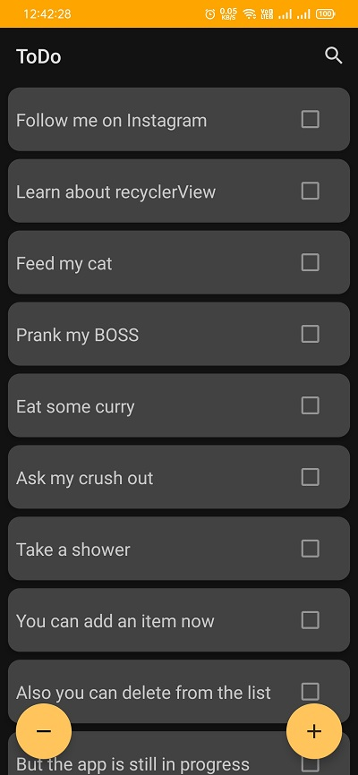
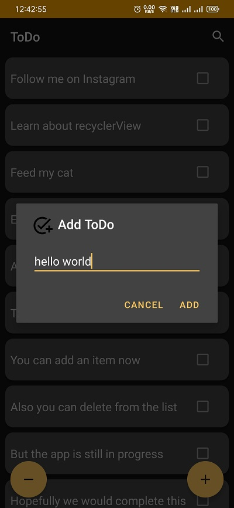
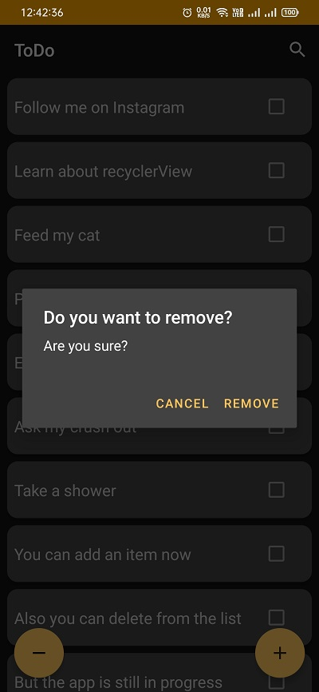

## ToDoList
This is a todo list android application where user can insert/delete todos.
Todos will be stored locally using SQLite for android.
No cloud(firebase) is used hence once app is uninstalled user won't be able to retrieve their data.

This app demonstrates the following:
+ layouts
+ alert dialog
+ floating action button
+ recyclerView (delete and insert methods)
+ android-architecture component
+ LiveData
+ ViewModel
+ Room for SQLite

## ScreenShots:

### Splash Screen

### Home

### Add Dialog

### Remove Dialog

